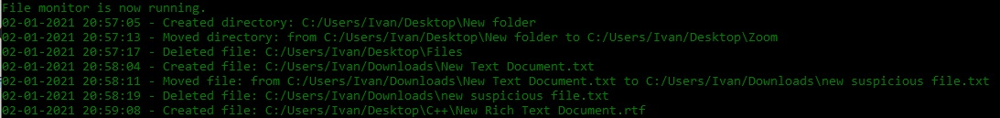

# File Watchdog
### A defensive programming script that allows you to track changes in multiple folders simultaneously.

#### The script is written in Python and uses the Watchdog module and the Multiprocessing package:
Multiprocessing is a package that supports spawning processes using an API similar to the threading module. The multiprocessing package offers both local and remote concurrency, effectively side-stepping the Global Interpreter Lock by using subprocesses instead of threads. Due to this, the multiprocessing module allows the programmer to fully leverage multiple processors on a given machine. It runs on both Unix and Windows.

#### Further information and documentation: 
- `Multiprocessing` → https://docs.python.org/3/library/multiprocessing.html
- `Watchdog` → https://pythonhosted.org/watchdog/

#### Disclaimer:
#### All the scripts and instructions in this repository are for educational and informational purposes only, such as Ethical Hacking, Security, Penetration Testing and malware analysis. I do not promote, encourage, support or excite any illegal activity or hacking without written permission in general.
